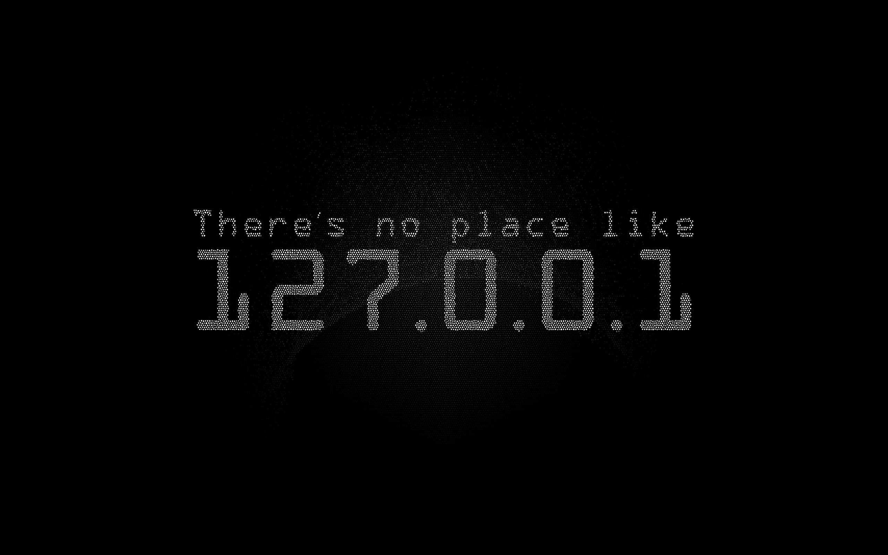

 
<h1 align="center">WELCOME!</h1>

<h3 align="center">I'm a Computer Engineer and Instructor</h3>

[][linkedin]
[][twitter]
[][gmail]
[][youtube]

[linkedin]: https://www.linkedin.com/in/furkan-y%C4%B1ld%C4%B1z-90342a138/
[twitter]: https://www.twitter.com/frkann17/
[gmail]: mailto:frknyldz8489@gmail.com
[youtube]: https://www.youtube.com/channel/UCPJJbWeR2r1Rs_FWQhsPaFw

 
 

 
<h3 align="center">Languages and Tools</h3>

  
           

 
 

 
 

 

 

🌱 **I’m currently learning Python Flask**  

 💬 **Please Follow Us on Youtube for our educations** [HELLO WORLD](https://www.youtube.com/channel/UCPJJbWeR2r1Rs_FWQhsPaFw)  

 📄 **My Personal Website** [https://www.frknyldz.site](https://www.frknyldz.site)

 
 

 

<b><h3 align="center"> Click and Visit Our Youtube Channel For These Courses </h3></b>

 

   

 

   

 

   

 

<h5 align='center'> Don't Forget Sucscribe to the Channel Please, Thank You 
 

</h5>

 

